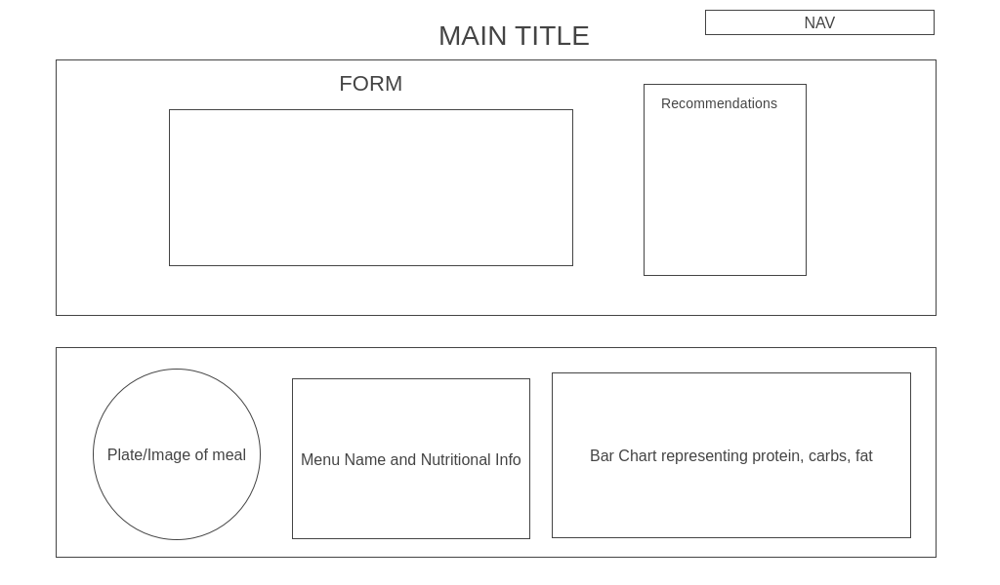

## Background

Have you ever wanted to grab a quick meal from a fast food restaurant or chain, but wanted to be smart about it? Calorie Calculator will help achieve this for you! Simply submit your total calorie intake and any additional filters (protein, carbs, fat) and all options available will appear before your eyes. Feel free to change your initial numbers and your options will magically adjust to your liking. You will also be able to see which meal option has the highest protein, fat, or carbs.

## Functionality & MVPs

In Calorie Calculator, users will be able to:
- Choose their meals from McDonalds, Chipotle, or Tacobell, displaying full nutrional value
- Insert their customized calorie intake with protein, carbs, and fat options
- Sort meal items by highest calories, protein, carbs, or fat
- Adjust meal options

In addition, this project will include
- An About for diet recommendations by the United States Dietary Guidelines
- A production README

## Wire Frames

- Nav links include links to this project's Github repo and my LinkedIn.
- Form will include brand icons and text boxes for calories, protein, carb, and fat.
- On bottom left, meal items will appear on a plate once options are generated
- On bottom right, additional nutritional data will be presented in a bar chart

## Technologies, Libraries, APIs

This project will be implemented with the following technologies:
- Spooncular API for the dataset
- Chart.js or D3.js to animate the bar chart
- Webpack and Babel to bundle and transpile the source JavaScript code
- npm to manage project dependences

## Imprementation Timeline

- Friday Afternoon & Weekend: Set up project, including getting webpack up and running. Learn how to use API. Set up backend if needed to hide API keys. Start building MenuItem class and methods. Start implementing logic needed to calculate calories based on prefernces chosen.

- Monday: Build out basic HTML structure, create form. Start implementing bar chart with chart.js or D3.js.

- Tuesday: Hopefully, have all links connected and make sure everything is being rendered properly before moving on. Start focus on styling with CSS.

- Wednesday: Finish styling page. Add bonus features if there is time.

- Thursday Morning: Deploy to GitHub pages.

## Bonus Features

There are so many ways in which this calculator can be even more helpful and customizable. Some updates can be:
- Add string query so user can search for a item they like and meal with be focused on surrounding that item
- Chart comparason between current meal and US recommended quidelines

