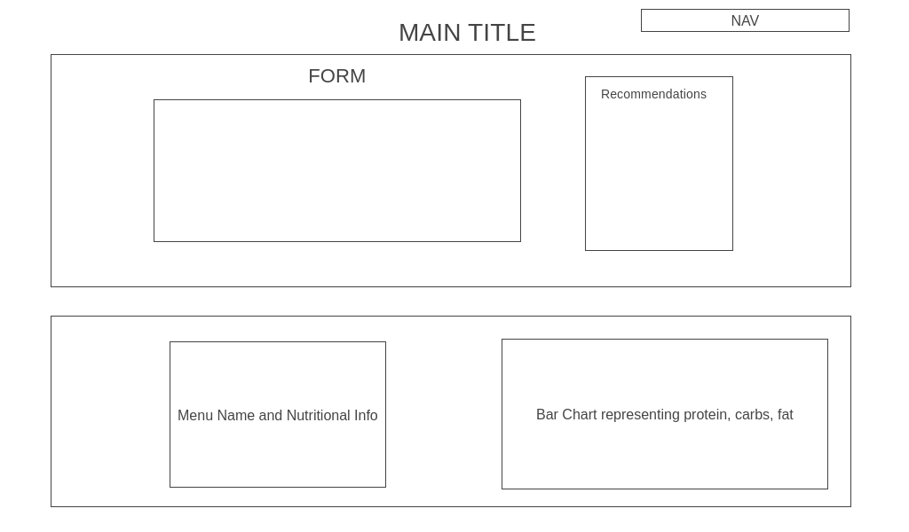

### [Eat Deliberately](https://vnchen92.github.io/calorie_calc/)

## Background

Track your macronutrients (macros) and calories at Subway if you are calorie conscious or macro conscious. Customize your sandwich and see how much protein, carb, and fat you are consuming. Visualize your macros and calories dynamically on a bar chart as you update and edit your options. View what you have already selected either on a list or as you make your sandwich.

## Functionality & MVPs

Users will be able to:
- Choose menu items and customize their meal
- Adjust, edit, and clear meal options
- View what they have currently selected, the current total calories compared to protein, carb, and fat, as they choose their options
- Compare what they have currently selected to the U.S Dietary Guidelines for Americans

## Wire Frames

- Footer will include links to this project's Github repo and my LinkedIn, AngelList, and Portfolio.
- Left will contain all customizable items 
- Right will contain bar chart showing total calories and macros as each option is selected.

## Technologies, Libraries, APIs

This project will be implemented with the following technologies:
- Nutritional information from Subway (public)
- Chart.js to animate the bar chart
- Vanilla DOM to manipulate document structure, style, and content
- Webpack and Babel to bundle and transpile the source JavaScript code
- npm to manage project dependences

## Imprementation Timeline

- Friday Afternoon & Weekend: Set up project, including getting webpack up and running. Convert Subway PDF nutrional information to accessable data. Set up backend if needed. Make sure data converted is fully functional. Start implementing logic needed to calculate calories based on preferences chosen.

- Monday: Build out basic HTML structure. Learn more about Chart.js. Start implementing bar chart with Chart.js. Start implementing methods to update the chart as options are entered.

- Tuesday: Make sure everything is being rendered properly before moving on. Focus on styling with CSS. Switch back and forth between javascript and CSS.

- Wednesday: Finish styling page. Add bonus features if there is time.

- Thursday Morning: Deploy to GitHub pages.

## Bonus Features

There are so many ways in which this calculator can be more helpful and customizable. Some updates can be:
- Splash page: implement form for user preferences on maximum calories, carb, protein, and fat intake to customize bar chart before render
- Chart comparason between current meal and US recommended guidelines
- Addition of other popular fast food restaurants such as McDonald's and Chipotle

## Credits

- LinkedIn, GitHub, AngelList, and Portfolio icons provided by https://icons8.com/
- Name and Title Font provided by https://fontmeme.com/
- Giant baquette background image provided by https://www.vecteezy.com/vector-art/
- Menu images provided by https://www.flaticon.com/ and https://icons8.com/
- Mini Subway sandwich image provided by https://www.kissclipart.com/

